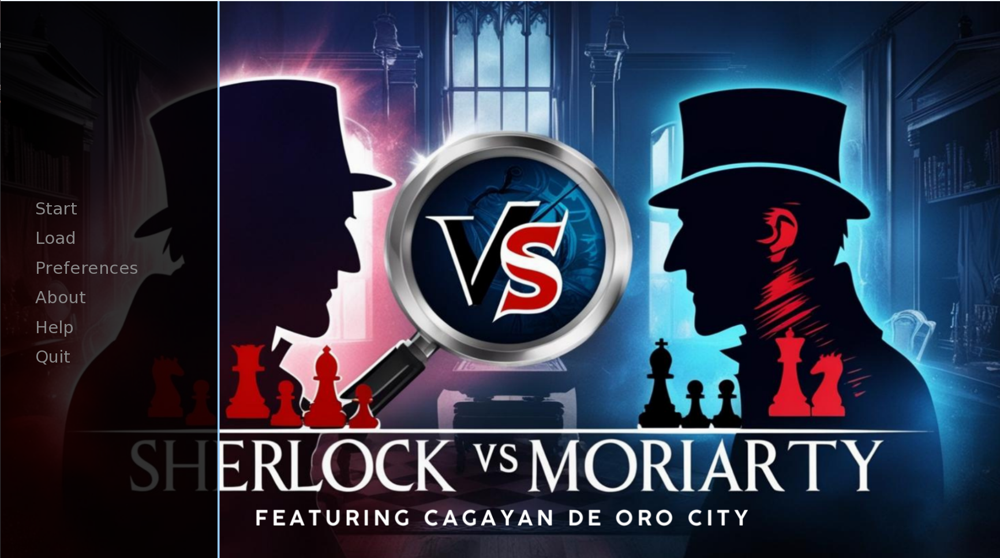
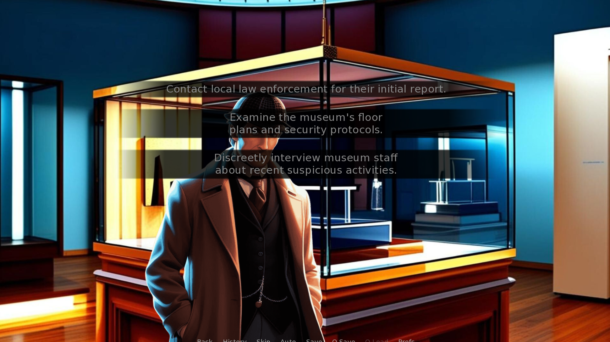
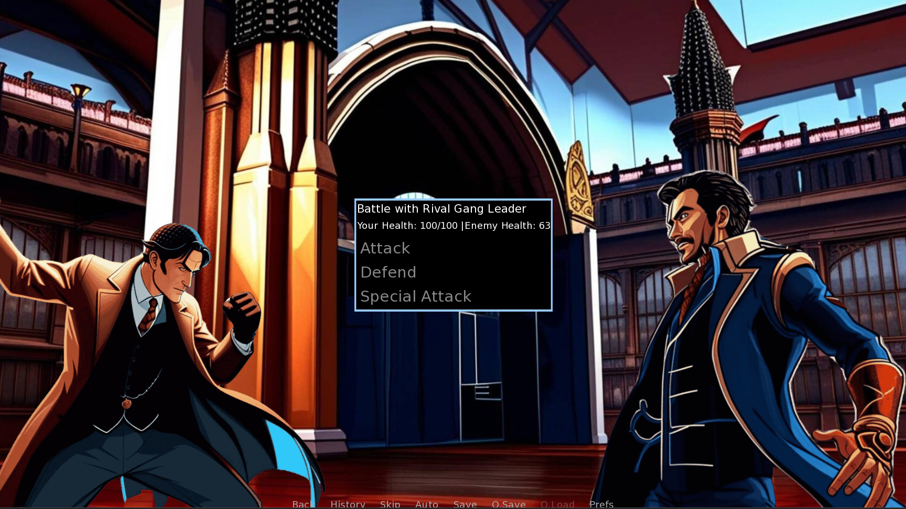

# Sherlock vs Moriarty VN

A visual novel game featuring a unique twist on the legendary rivalry between Sherlock Holmes and Professor Moriarty, set in Cagayan De Oro City.

## Description

This is an interactive visual novel where players can choose to experience the story from two perspectives: either as the brilliant detective Sherlock Holmes or as the cunning criminal mastermind Professor Moriarty. Set in the vibrant city of Cagayan De Oro, Philippines, players will make crucial decisions that affect the outcome of the story.

## Technologies Used

- Ren'Py Visual Novel Engine
- Python
- Canva (for artwork)

## How to Run

1. **Prerequisites**

   - Download and install [Ren'Py](https://www.renpy.org/latest.html)

2. **Running the Game**
   - Clone this repository:
     ```
     git clone https://github.com/yourusername/SherlockVsMoriartyVN.git
     ```
   - Launch Ren'Py
   - Add the game directory to Ren'Py
   - Select "Launch Project" to start the game

## Screenshots


_Main menu of the game_


_A scene from the investigation_


_A critical decision moment during combat_

## Features

- Play as either Sherlock Holmes or Professor Moriarty
- Multiple storylines based on player choices
- Fighting mechanics
- Multiple endings
- Unique setting in Cagayan De Oro City

## Credits

Created as a school project by:

- [@Me](https://github.com/RigelKukoy)
- [@keyceerhaye](https://github.com/keyceerhaye)

## Contributing

Feel free to fork this project and submit pull requests. For major changes, please open an issue first to discuss what you would like to change.
